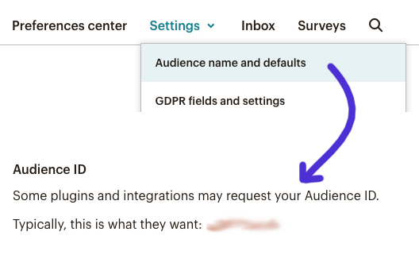
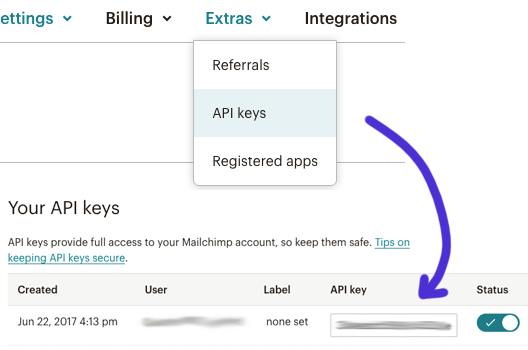

Simple Mailchimp plugin for Craft 3
===

A minimal Craft 3 plugin to connect forms to Mailchimp

## Installation

```bash
composer require leowebguy/simple-mailchimp
```

On your Control Panel, go to Settings → Plugins → "Simple Mailchimp" → Install

## Usage

Gather the necessary parameters from Mailchimp

#### API Key (MC_API_KEY)

Go to https://admin.mailchimp.com/lists > Select Audience > Settings > Audience name and defaults > Audience ID



#### Audience ID (MC_LIST_ID)

Go to https://admin.mailchimp.com/account/api/ > API Key



Add the credentials to your .env file

```dotenv
MC_API_KEY=1abcdef1234a1234a0abc123ed1234aa-us14
MC_LIST_ID=aaa123abcde
```

Your newsletter form template can look something like this:

```html
<form method="post" class="newsletter">
    {{ csrfInput() }}
    <input type="hidden" name="tags" value="Tag_1,Tag_2"> {# comma separated #}
    <input type="text" class="form-control" name="name">
    <input type="email" class="form-control" name="email">
    <button type="submit">Submit</button>
    <span class="newsletter-notification" style="display: none"></span>
</form>
```

_The only required field is `email`. Everything else is optional._

```js
(function($) {
    $('form.newsletter').submit(function(e) {
        e.preventDefault();
        $.post({
            url: '/mailchimp/send',
            data: $(this).serialize(),
            success: (r) => {
                if (r.success == true) {
                    $('.newsletter-notification')
                        .text(r.msg)
                        .fadeIn()
                        .delay(6000).fadeOut();
                    $(this).trigger("reset");
                    console.log(`%c${r.msg}`, 'color:#2c8'); // testing purposes
                    console.log(`%cID: ${r.id}`, 'color:#2c8'); // testing purposes
                } else {
                    $('.newsletter-notification')
                        .text(r.msg)
                        .fadeIn()
                        .delay(6000).fadeOut();
                    console.log(`%c${r.msg}`, 'color:#e24'); // testing purposes
                }
            },
            error: (r) => {
                $('.form-notification')
                    .text(r.msg)
                    .fadeIn()
                    .delay(6000).fadeOut();
                console.log(`%c${r.msg}`, 'color:#e24'); // testing purposes
            },
        });
    });
})(jQuery);
```
